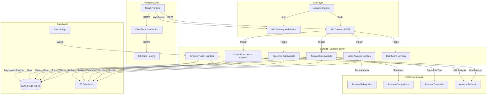

# MindBridge: Multi-Modal Emotion Intelligence Platform

## Overview
MindBridge is a comprehensive emotion intelligence platform that leverages AWS serverless architecture to provide real-time emotion analysis across multiple modalities. The platform serves three key areas: Corporate Wellness Monitoring, Call Center Agent Support, and Digital Mental Health Coaching.

## Core Features
- Real-time video emotion detection
- Text sentiment analysis
- Live call analysis
- Mental health check-ins
- Comprehensive emotion analytics
- Corporate wellness monitoring
- Call center agent coaching
- Digital mental health support

## AWS Lambda Architecture

### System Architecture Overview
Our application uses a sophisticated serverless architecture centered around AWS Lambda functions, enabling scalable, event-driven processing of emotional data across multiple modalities.



### Lambda Functions Detail

1. **Video Analysis Lambda (`video_analysis`)**
   - **Trigger**: API Gateway (REST)
   - **Purpose**: Real-time facial emotion detection
   - **Services Used**: 
     - Amazon Rekognition for facial analysis
     - S3 for frame storage
     - DynamoDB for result storage
   - **Key Features**:
     - Frame extraction and processing
     - Multi-face detection
     - Emotion confidence scoring
     - Real-time result streaming

2. **Text Analysis Lambda (`text_analysis`)**
   - **Trigger**: API Gateway (REST)
   - **Purpose**: Sentiment and emotion analysis from text
   - **Services Used**:
     - Amazon Comprehend for sentiment analysis
     - Amazon Bedrock for context understanding
     - DynamoDB for result storage
   - **Key Features**:
     - Multi-language support
     - Context-aware analysis
     - Entity recognition
     - Key phrase extraction

3. **Real-time Call Analysis Lambda (`realtime_call_analysis`)**
   - **Trigger**: API Gateway (WebSocket)
   - **Purpose**: Live voice emotion analysis
   - **Services Used**:
     - Amazon Transcribe for speech-to-text
     - Amazon Comprehend for sentiment
     - Amazon Bedrock for context
   - **Key Features**:
     - Real-time audio processing
     - Voice emotion detection
     - Live transcription
     - Immediate feedback

4. **Check-in Processor Lambda (`checkin_processor`)**
   - **Trigger**: API Gateway (REST)
   - **Purpose**: Process mental health check-ins
   - **Services Used**:
     - Amazon Bedrock for insight generation
     - DynamoDB for data storage
     - EventBridge for notifications
   - **Key Features**:
     - Dynamic question generation
     - Response analysis
     - Trend detection
     - Alert generation

5. **Emotion Fusion Lambda (`emotion_fusion`)**
   - **Trigger**: EventBridge
   - **Purpose**: Aggregate and analyze multi-modal data
   - **Services Used**:
     - Amazon Bedrock for advanced analysis
     - DynamoDB for data storage
     - S3 for data archival
   - **Key Features**:
     - Cross-modal analysis
     - Pattern recognition
     - Insight generation
     - Trend analysis

6. **Dashboard Lambda (`dashboard`)**
   - **Trigger**: API Gateway (REST)
   - **Purpose**: Generate analytics dashboards
   - **Services Used**:
     - DynamoDB for data retrieval
     - Amazon Bedrock for insights
   - **Key Features**:
     - Custom metric calculation
     - Visualization data preparation
     - Report generation
     - Alert processing

### Data Flow
1. Frontend applications send requests through CloudFront to API Gateway
2. API Gateway triggers appropriate Lambda functions
3. Lambda functions process data using AI services
4. Results are stored in DynamoDB and S3
5. EventBridge triggers emotion fusion for comprehensive analysis
6. Dashboard Lambda generates visualizations and reports

### Security and Compliance
- Cognito user authentication
- IAM role-based access
- End-to-end encryption
- HIPAA compliance measures
- Data privacy controls
- Audit logging

### Scalability and Performance
- Automatic scaling with Lambda
- DynamoDB on-demand capacity
- CloudFront edge caching
- S3 for static assets
- WebSocket for real-time data
- Event-driven architecture

## Getting Started

### Prerequisites
- AWS Account with appropriate permissions
- Node.js and npm installed
- Python 3.8+ installed
- AWS CLI configured

### Installation
1. Clone the repository
```bash
git clone https://github.com/yourusername/mindbridge.git
cd mindbridge
```

2. Install frontend dependencies
```bash
cd frontend
npm install
```

3. Deploy infrastructure
```bash
cd ../infrastructure
python -m venv .venv
source .venv/bin/activate
pip install -r requirements.txt
cdk deploy
```

4. Deploy Lambda functions
```bash
cd ../scripts
bash deploy-frontend-backend.sh
```

### Configuration
- Update `config.prod.js` with your AWS resources
- Configure Cognito user pool settings
- Set up environment variables
- Update API endpoints

## Documentation
- [Video Emotion Detection](docs/VIDEO_EMOTION_DETECTION.md)
- [Text Sentiment Analysis](docs/TEXT_SENTIMENT_ANALYSIS.md)
- [Real-time Call Analysis](docs/REALTIME_CALL_ANALYSIS.md)
- [Mental Health Check-in](docs/MENTAL_HEALTH_CHECKIN.md)
- [Emotion Analytics](docs/EMOTION_ANALYTICS.md)
