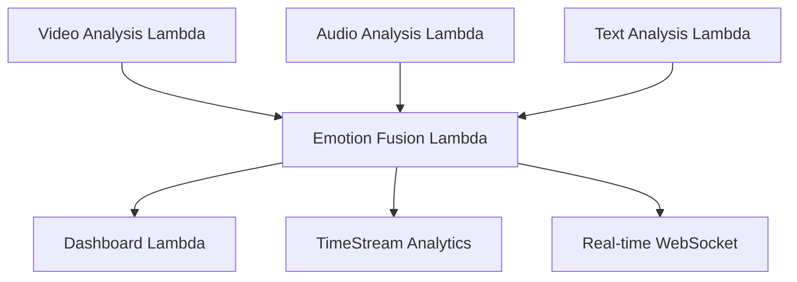
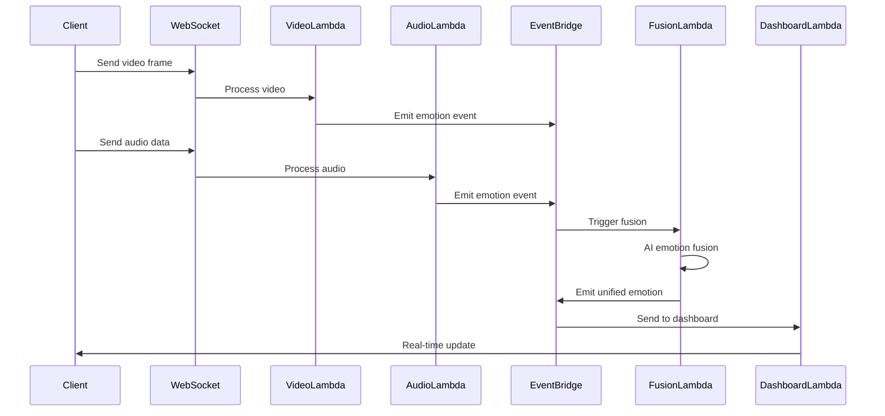
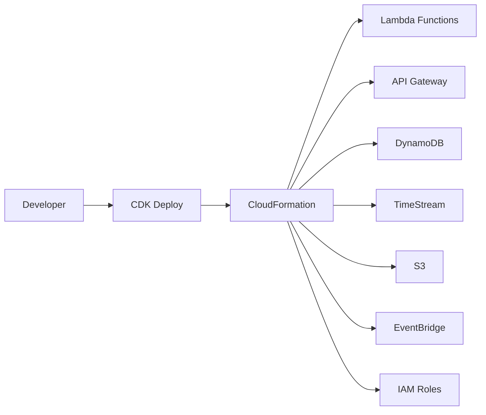

# 🏗️ MindBridge AI Architecture

## Overview

MindBridge AI is a **Lambda-first serverless architecture** designed for real-time emotional intelligence analysis. The platform uses multi-modal AI to analyze video, audio, and text inputs to provide unified emotion insights and personalized recommendations.

## Architecture Principles

- **Serverless-First**: Every component runs on AWS Lambda for maximum scalability
- **Event-Driven**: Components communicate through EventBridge and WebSocket events
- **Multi-Modal**: Combines video, audio, and text analysis for comprehensive insights
- **Real-Time**: Sub-second latency for live emotion analysis
- **AI-Powered**: Uses Amazon Bedrock (Claude) for intelligent emotion fusion

## System Components

### 🧠 Core Lambda Functions

#### 1. Video Analysis Lambda
- **Trigger**: API Gateway WebSocket
- **Purpose**: Facial emotion detection using Amazon Rekognition
- **Input**: Base64 encoded video frames
- **Output**: Emotion scores, confidence levels, face metadata
- **Runtime**: Python 3.9
- **Memory**: 1024 MB
- **Timeout**: 30 seconds

#### 2. Audio Analysis Lambda
- **Trigger**: API Gateway WebSocket  
- **Purpose**: Voice emotion analysis and speech-to-text
- **Input**: Base64 encoded audio data
- **Output**: Voice emotions, speech sentiment, speaking rate
- **Services**: Amazon Transcribe, Amazon Comprehend
- **Runtime**: Python 3.9
- **Memory**: 1024 MB
- **Timeout**: 30 seconds

#### 3. Text Analysis Lambda
- **Trigger**: API Gateway WebSocket
- **Purpose**: Text sentiment analysis
- **Input**: Chat messages, transcribed speech
- **Output**: Sentiment scores, emotional indicators
- **Services**: Amazon Comprehend
- **Runtime**: Python 3.9
- **Memory**: 512 MB
- **Timeout**: 15 seconds

#### 4. Emotion Fusion Lambda
- **Trigger**: EventBridge (from other Lambdas)
- **Purpose**: AI-powered multi-modal emotion fusion
- **Input**: Recent emotion data from all modalities
- **Output**: Unified emotion state, personalized recommendations
- **Services**: Amazon Bedrock (Claude 3 Sonnet)
- **Runtime**: Python 3.9
- **Memory**: 1024 MB
- **Timeout**: 2 minutes

#### 5. Dashboard Lambda
- **Trigger**: API Gateway WebSocket
- **Purpose**: Real-time dashboard and analytics
- **Input**: Dashboard requests, analytics queries
- **Output**: Real-time emotion data, historical analytics
- **Services**: DynamoDB, TimeStream
- **Runtime**: Python 3.9
- **Memory**: 512 MB
- **Timeout**: 30 seconds

### 📊 Data Layer

#### DynamoDB Tables

**mindbridge-emotions**
- **Partition Key**: user_id
- **Sort Key**: timestamp
- **Purpose**: Store all emotion analysis results
- **TTL**: 30 days
- **Indexes**: session-index (session_id, timestamp)

**mindbridge-users**
- **Partition Key**: user_id
- **Purpose**: User profiles and preferences
- **No TTL**: Persistent user data

#### TimeStream Database
- **Database**: MindBridge-{stage}
- **Table**: emotions
- **Purpose**: Time-series emotion analytics
- **Retention**: 24 hours (memory), 30-365 days (magnetic)

#### S3 Bucket
- **Purpose**: Temporary audio/video storage
- **Lifecycle**: Auto-delete after 7 days
- **Encryption**: S3 managed keys

### 🌐 API Layer

#### WebSocket API
- **Purpose**: Real-time bidirectional communication
- **Routes**:
  - `$connect`: Connection management
  - `$disconnect`: Cleanup
  - `$default`: General message handling
  - `video-analysis`: Video emotion processing
  - `audio-analysis`: Audio emotion processing

#### HTTP API
- **Purpose**: RESTful endpoints for dashboard
- **CORS**: Enabled for frontend access
- **Routes**: `/dashboard/{proxy+}`

### 🎯 Event-Driven Architecture

### 🔄 Data Flow

1. **Input Capture**: Frontend captures video/audio/text
2. **Initial Analysis**: Modality-specific Lambdas process raw data
3. **Event Emission**: Results published to EventBridge
4. **AI Fusion**: Claude analyzes multi-modal data
5. **Storage**: Results stored in DynamoDB and TimeStream
6. **Real-time Updates**: Dashboard receives live updates via WebSocket

### 🚀 Deployment Architecture

### 📈 Scalability Features

- **Auto-scaling**: Lambda automatically scales based on demand
- **Concurrent Execution**: Up to 1000 concurrent Lambda executions
- **DynamoDB On-Demand**: Automatic scaling for database operations
- **EventBridge**: Handles millions of events per second
- **WebSocket Connections**: Scales to 100,000+ concurrent connections

### 🔒 Security

- **IAM Roles**: Least privilege access for all components
- **VPC**: Optional VPC deployment for additional isolation
- **Encryption**: All data encrypted at rest and in transit
- **API Gateway**: Built-in DDoS protection and throttling
- **CloudWatch**: Comprehensive logging and monitoring

### 🌍 Multi-Environment Support

- **Development**: Local testing with SAM CLI
- **Staging**: Pre-production environment
- **Production**: Optimized for scale and reliability
- **Environment Variables**: Different configurations per stage

### 📊 Monitoring & Observability

- **CloudWatch Logs**: Centralized logging for all Lambda functions
- **CloudWatch Metrics**: Custom metrics for emotion analysis
- **X-Ray Tracing**: Distributed tracing for performance optimization
- **Alarms**: Automated alerting for errors and performance issues

### 🎯 Performance Targets

- **Emotion Analysis Latency**: < 500ms per modality
- **AI Fusion Processing**: < 2 seconds
- **WebSocket Response Time**: < 100ms
- **Concurrent Users**: 10,000+ simultaneous sessions
- **Data Retention**: 30 days hot, 1 year cold storage

## Technology Stack

### Backend
- **Compute**: AWS Lambda (Python 3.9)
- **API**: API Gateway (WebSocket + HTTP)
- **Database**: DynamoDB + TimeStream
- **Storage**: S3
- **AI/ML**: Amazon Bedrock, Rekognition, Transcribe, Comprehend
- **Events**: EventBridge
- **Infrastructure**: AWS CDK (TypeScript)

### Frontend
- **Framework**: React 18 with TypeScript
- **UI Library**: Material-UI (MUI)
- **State Management**: React Hooks
- **Real-time**: WebSocket API
- **Charts**: Chart.js + Recharts
- **Animations**: Framer Motion

### DevOps
- **IaC**: AWS CDK
- **Deployment**: CloudFormation
- **Monitoring**: CloudWatch
- **Version Control**: Git
- **CI/CD**: GitHub Actions (future)

This architecture ensures high availability, scalability, and real-time performance for the MindBridge AI emotional intelligence platform. 